# BAKALAR-BOOKING-APP

## Introduction:

This web application is a booking system for a restaurant, created with django and bootstrap. This project uses CRUD functionality to give users the options to create, read, update and delete their bookings, also including a small menu section and a contact section where the user can find information of interest about the restaurant.

Visit the deployed website [here](https://bakalar-booking-app-f4bee72469cb.herokuapp.com/).

## Table of Contents

- [BAKALAR-BOOKING-APP](#bakalar-booking-app)
  - [Introduction:](#introduction)
  - [Table of Contents](#table-of-contents)
  - [User Experience (UX)](#user-experience-ux)
    - [Project Goals](#project-goals)
    - [User Stories](#user-stories)
    - [Strategy Table](#strategy-table)
  - [Scope](#scope)
    - [Phase 1](#phase-1)
    - [Phase 2](#phase-2)
  - [Structure](#structure)
    - [Database model](#database-model)
    - [Colour Scheme](#colour-scheme)
    - [Typography](#typography)
    - [Wireframes](#wireframes)
  - [Features](#features)
    - [General](#general)
    - [Home Page](#home-page)
    - [Register Page](#register-page)
    - [Edit User Profile Page](#edit-user-profile-page)
    - [Login and Logout](#login-and-logout)
    - [Menu page](#menu-page)
    - [Booking Page, Preview Booking Page and Booking Confirmation](#booking-page-preview-booking-page-and-booking-confirmation)
    - [Check Your Bookings Page](#check-your-bookings-page)
    - [Edit Bookings](#edit-bookings)
    - [Contact Us](#contact-us)
    - [Forbidden Page](#forbidden-page)
  - [Technologies Used](#technologies-used)
    - [Languages Used](#languages-used)
    - [Frameworks, Libraries and Programs Used](#frameworks-libraries-and-programs-used)
    - [Packages / Dependecies Installed](#packages--dependecies-installed)
  - [Testing](#testing)
    - [Testing User Stories](#testing-user-stories)
    - [Code Validation](#code-validation)
    - [Accessibility](#accessibility)
    - [Tools Testing](#tools-testing)
    - [Manual Testing](#manual-testing)
  - [Deployment](#deployment)
  - [Credits](#credits)
    - [Content](#content)
    - [Media](#media)
    - [Code](#code)
  - [Acknowledgements](#acknowledgements)

***

## User Experience (UX)

We all have booked a table at a restaurant at some point and being able to do so through a web service should not be an unpleasant experience. For this reason, my project aims to give the user a clear vision of the options available at all times, trying to offer the most complete service possible when booking a table.

### Project Goals

- Responsive design to make the website accessible on different screen sizes.
- Well structured website and easy to navigate.
- Provide security in access to user data and their bookings.
- Allows CRUD functionality for bookings.

### User Stories

Throughout the project I used the GitHub projects board to log all user stories. I used an AGILE perspective to manage the user stories inside my github project. 

- USER STORIE 1: As a Admin I can manage the bookings so that I can all the data provided by the user and accept the bookings.
- USER STORIE 2: As a User I can select time, date, number of guests and add comments to my booking so that I describe my booking details properly.
- USER STORIE 3: As a User I can edit my booking so that I can change the date, time, number of guests or add a comment.
- USER STORIE 4: As a User I can delete my booking from the website so that I can cancel it.
- USER STORIE 5: As a User I can view my booking so that I can check my booking details and status.
- USER STORIE 6: As a User I can book a table in the website so that I don't need to call the restaurant for a booking.
- USER STORIE 7: As a User I can see the correct restaurant address so that I could find the exact location of the restaurant, the better route and the estimated time of arrival.
- USER STORIE 8: As a User I can navigate to contact page so that I can have the restaurant address and contact details.
- USER STORIE 9: As a User I can see the restaurant menu so that I can decide to book a table or not.
- USER STORIE 10: As a User I can create a user profile so that I can login to book a table.
- USER STORIE 11: As a user I can edit my user profile so that I can update my data on the website.
  
### Strategy Table
Opportunity/Problem/Feature| Importance| Viability/Feasibility
------------ | -------------------------|---------
Responsive design | 5 | 5
Display restaurant Menu | 5 | 5
Account registration | 5 | 5
User profile | 5 | 5
Create a booking | 5 | 5
Update a booking | 5 | 5
Cancel a booking | 4 | 4
Contact form | 3 | 4
Avoid double bookings | 4 | 1
Booking acceptance email | 3 | 1

Total | 44 | 40

[Go to the top](#table-of-contents)

## Scope

 As all features can't be implemented in the first release of the project, the project will be divided in two phases. The first phase will include the features that have been identified in order to build the minimum viable product.

### Phase 1

* Responsive design 
* Account registration
* User profile
* Display restaurant Menu
* Create a booking
* Update a booking
* Cancel a booking

### Phase 2

* Contact form
* Avoid double bookings
* Booking acceptance email
* Account email verification
* Social media signup

[Go to the top](#table-of-contents)

## Structure

### Database model

This is the database scheme first model:
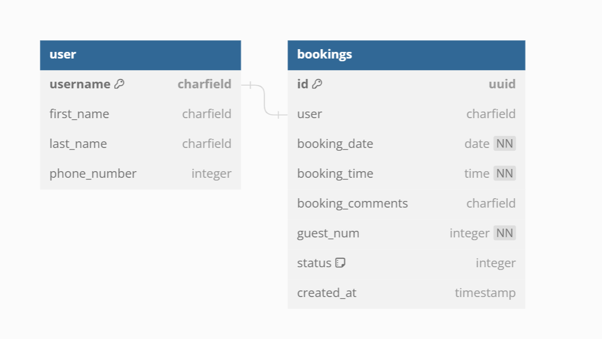

And this is the final database structure:
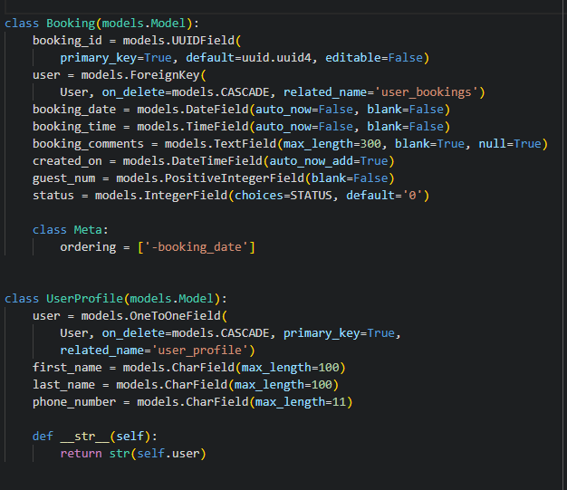

### Colour Scheme

I decided to use a gradient background from [Uigradients](https://uigradients.com/)

### Typography

I chose 2 fonts for this project, Baskerville and Bebas Neue with sans serif as fallback font for both.

This fonts can be found [here](https://fonts.google.com/)

### Wireframes

[Balsamiq](https://balsamiq.com/) has been used to create all the wireframes for desktop and mobile views for this project.

Page | Desktop Version | Mobile Version
--- | --- | ---
Landing page/user logout |  | 
Landing page/ user login | 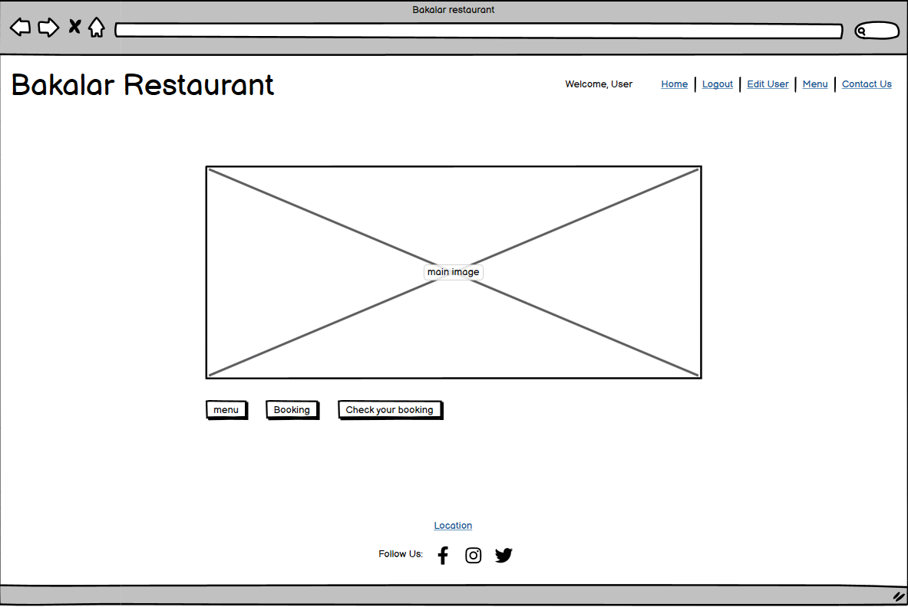 | 
Sign up page |  | 
Menu page |  | 
Sign in page |  | 
Sign out page |  | 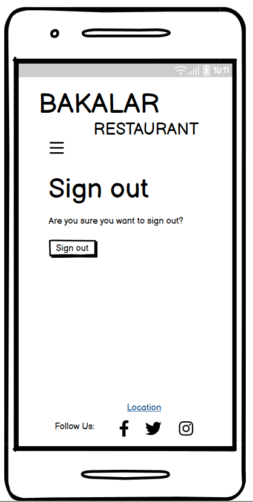
Contact page |  | 
Booking page | 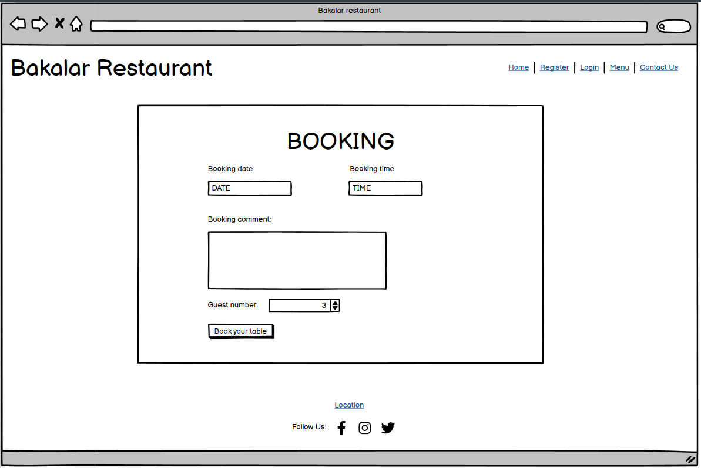 | 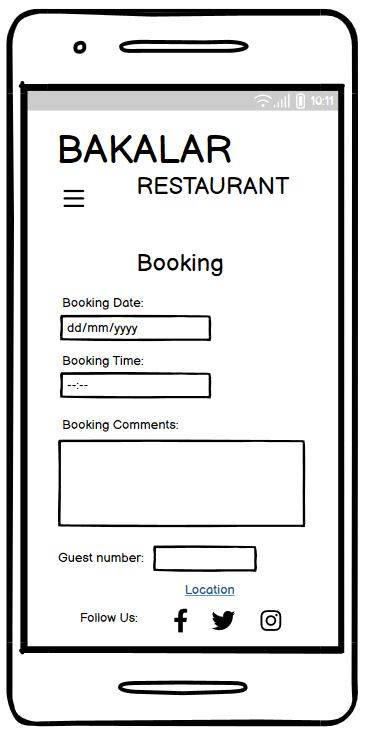
Booking Preview page |  | 
Check Booking page | 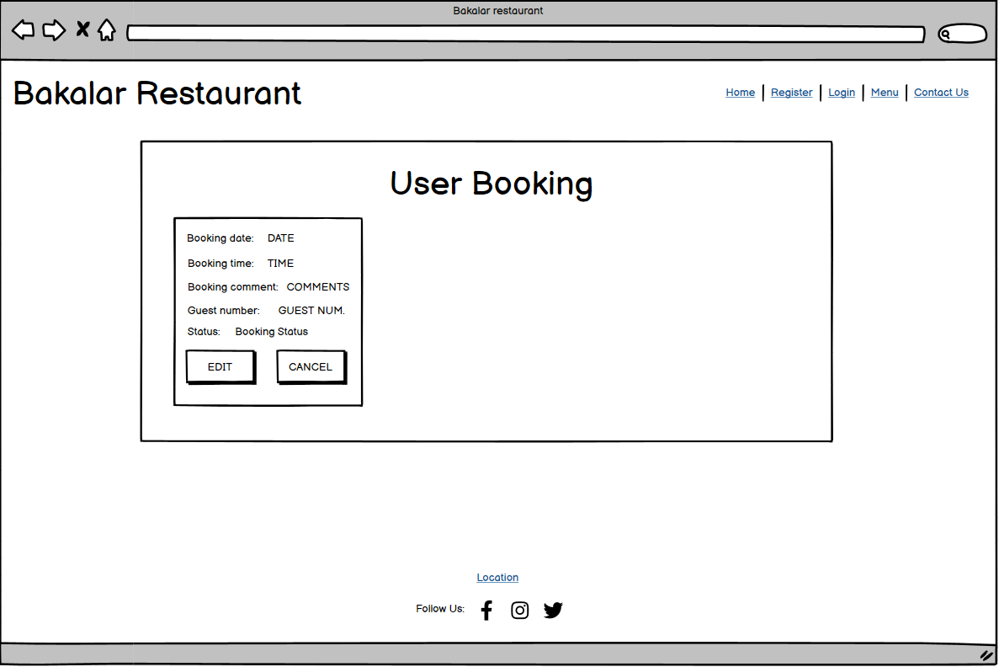 | 
Edit Booking page |  | 
Edit User Profile page |  | 

[Go to the top](#table-of-contents)

## Features

### General

This web application has been designed with bootstrap5 to be responsive across all devices.

* Navigation bar:
  - Navigation bar when there's no user logged in:

  - Navigation bar when there's a user logged in:

  - The navigation bar contains links to all the sections and  has a hover effect that changes color to provide feedback to the Site User for a better user experience. It also shows the active page highlighting the page name in yellow.

* Footer:
  - Footer image:

  - The footer contains a link (location) to contact page where the user can find a map, the restaurant address, an email and the phone number.
  - The footer contains links to social media channels.

### Home Page

- The home page displays a title on top of a main image
- Under the main image the user can find a menu button and a booking button when not logged in.

- When the user is logged in and has some bookings already the index page displays a third button named "check your bookings".

### Register Page

- This is a customized register form. First name, last name and phone number has been added to the original django registration form.
- The user name has to be unique as it is the primary key
- The email is the only optional field.
- The phone number needs to contain 11 digits
- Password1 and Password2 must match.
- The password need to contain letters and numbers and cannot be a very used password.
- All error messages will be posted in the form  to provide a correct feedback to the user in case something went wrong during the registration process.
- When the process is finished the User will receive a succesfull message.

### Edit User Profile Page

- The Edit User Profile Page cotains the three input fields that corresponds to the personal contact data from user profile.
- The phone number needs to be 11 digits long, and the form also provides error messages when an error occurs.
- When the process is finished the User will receive a succesfull message.

### Login and Logout

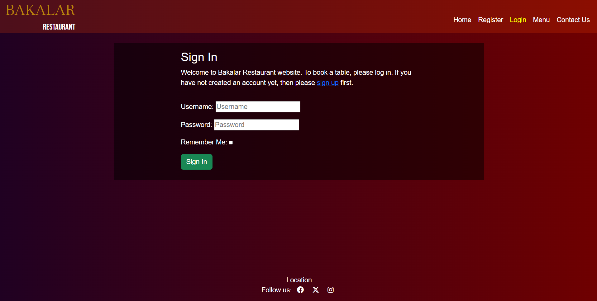

- The login page it's a simple login form where the user has to provide the Username and the password.
- The page displays a welcome message indicating the user that to make a booking they need to signup first in case the user don't have an account.
- Wrong credentials will trigger error messages to be displayed.
- When the process is finished the User will receive a succesfull message.

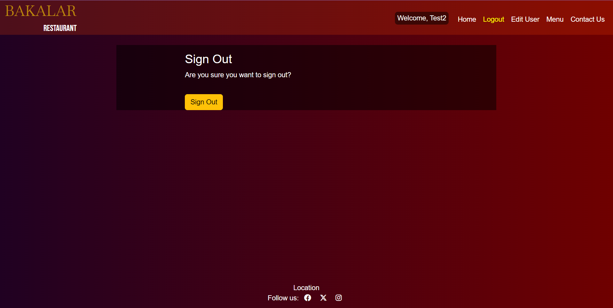

- This page only ask the user if the are sure to logout and the button to proceed.
- When the process is finished the User will receive a succesfull message.

### Menu page

- The menu page contains a carousel whit a group of images that shows the different dishes in the menu with an arrow system to navigate through it.
- Each image contains the name of the dish and a brief description.

### Booking Page, Preview Booking Page and Booking Confirmation

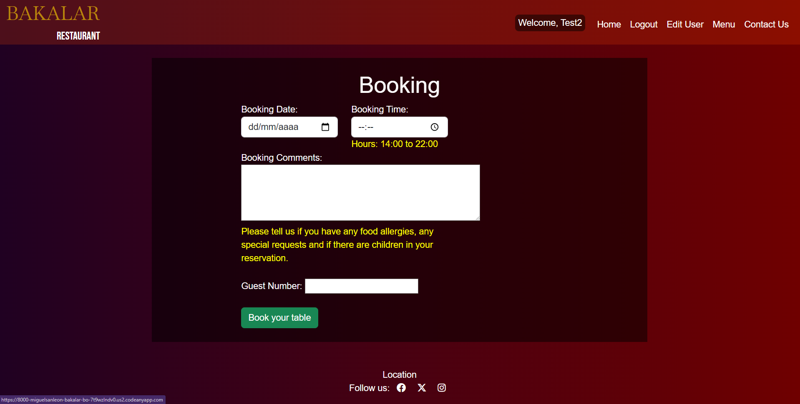

- The booking page show a booking form that contains 4 fields.

  1- The booking date field is required and must be a the present day or a future date. It has a calendar widget that can be use to pick the date.
  2- The booking time field is also required and must be between 14:00 and 22:00 as the message says. It also has a widget to pick the hour and minutes.
  3- The booking comments field is a text area where the user is invited to write any food allergy, special request and if there are any children in the group. This field is not required.
  4- The guest number field is required and has a limit of 12 people. If the user picks a number bigger than 12 then the form shows a message asking the user to call by phone for that special case.

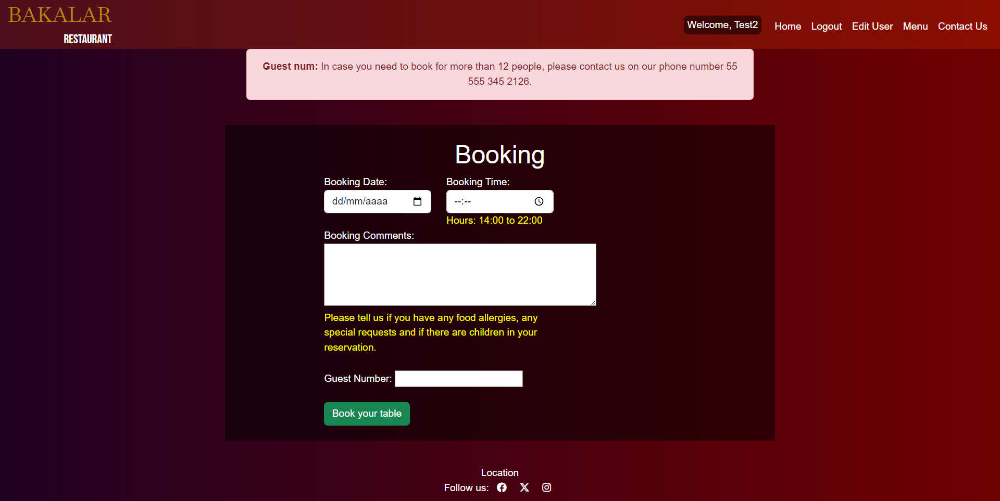

- The form displays error messages when an error occurs.
- When the user click on "book your table" button and the data is validated the user is redirected to the preview booking page.

- This page contains to sections, the Booking Preview section and the Edit Booking section.
- The Booking Preview section contains all the information that the user has provide in the booking form. Below that information there is a button to submit the booking as it is.
- The Edit Booking section is prepopulate with the booking information provided by the user and can be edited. Under the form there is a button to update the Preview Booking section with all the changes aplied to the booking.
- The form displays error messages when an error occurs.
- When the user click on "Submit your Booking" button, the user is redirected to the New Booking Page and a successful message is displayed in the New Booking Page.

- The New Booking Page shows all the booking details and a "Home" button under it.
- It also displays a message about the booking acceptance process and a "check your bookings" button where the user can check the booking status.

### Check Your Bookings Page

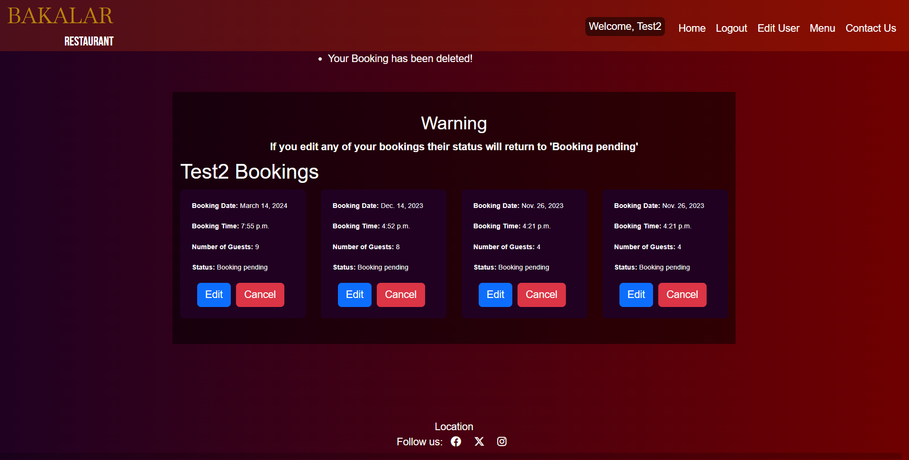

- This page contains all the users bookings displayed as cards with two buttons, edit and cancel.
- The cards also displays the status information of the booking so the user can see if the booking is pending, accepted or has been cancel by the restaurant.

- When the user click on cancel button the web shows a confirmation message with two buttons under it, Yes or No.
- When pressing "Yes" button the user is redirected to check your bookings page again and a succesful message will be shown in the page.
- If the user clicks on "No" button the user will be redirected to check your bookings page without deleting the booking.

### Edit Bookings

- If the user clicks on the "Edit" button in one of the booking cards, the user will be redirected to the Edit Booking page.
  

- The user can edit the booking data in the prepopulated form that will show the current booking data.
- If the user clicks on the "Save the Changes" button, he/she will be redirected to check your bookings page and the booking card will shown the new booking data. A succesful message will be post in the page.
- The form displays error messages when an error occurs.

### Contact Us

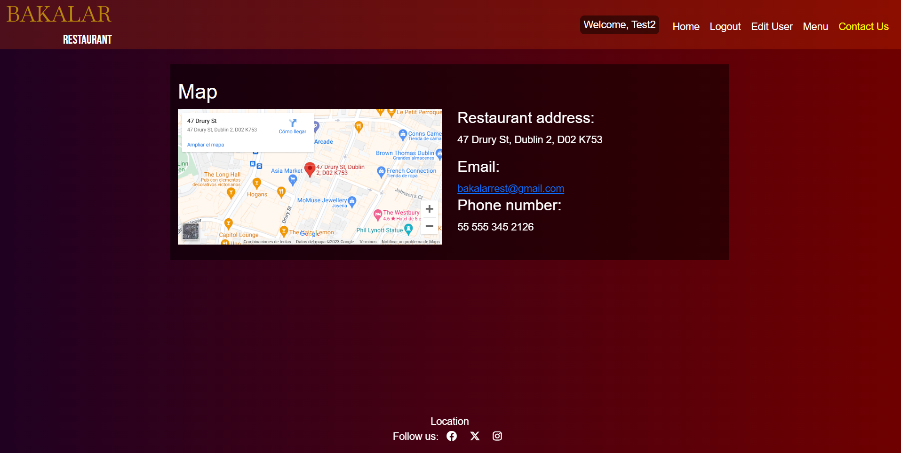

- In this page the user can find the contact information of the restaurant and a map that show the exact location of the restaurant.

### Forbidden Page

- This page shows a message if a user tries to access other users booking data using the edit booking page.

[Go to the top](#table-of-contents)

## Technologies Used

### Languages Used

- [HTML5](https://en.wikipedia.org/wiki/HTML)
  - The project uses HyperText Markup Language.
- [CSS3](https://en.wikipedia.org/wiki/CSS)
  - The project uses Cascading Style Sheets.
- [JavaScript](https://en.wikipedia.org/wiki/JavaScript)
  - The project uses JavaScript.
- [Python](https://en.wikipedia.org/wiki/Python_(programming_language))
  - The project uses Python.

### Frameworks, Libraries and Programs Used

- [Django 3](https://docs.djangoproject.com/en/3.2/)
  - The project uses Django 3.2
- [Boostrap 5](https://getbootstrap.com/docs/5.0/getting-started/introduction/)
  - The project uses Bootstrap 5.
- [ElephantSQL](https://customer.elephantsql.com/instance)
  - The project uses ElephantSQL as a database provider.
- [Codeanywhere](https://app.codeanywhere.com/)
  - The project uses Codeanywhere.
- [Chrome](https://www.google.com/intl/en_uk/chrome/)
  - The project uses Chrome to debug and test the source code using HTML5.
- [Balsamiq](https://balsamiq.com/)
  - Balsamiq was used to create the wireframes during the design process.
- [Google Fonts](https://fonts.google.com/)
  - Google fonts were used to import the fonts.
- [GitHub](https://github.com/)
  - GitHub was used to store the project's code after being pushed from Git.
- [Heroku](https://dashboard.heroku.com/apps)
  - Heroku was used to deploy the project.
- [Icons8](https://icons8.com/icons)
  - Icons8 was used to find a favicon for the project.
- [Dbdiagram](https://dbdiagram.io/home)
  - Dbdiagram was used to create the database diagram.
- [Tiny PNG](https://tinypng.com)
  - Tiny PNG was used to reduce the file size of the images.
- [Chrome DevTools](https://developer.chrome.com/docs/devtools/)
  - Chrome DevTools was used during development process for code review and to test responsiveness.
- [W3C Markup Validator](https://validator.w3.org/)
  - W3C Markup Validator was used to validate the HTML code.

- [W3C CSS Validator](https://jigsaw.w3.org/css-validator/)
  - W3C CSS Validator was used to validate the CSS code.

- [JSHint](https://jshint.com/)
  - The JSHints JavaScript Code Quality Tool was used to validate the site's JavaScript code.

### Packages / Dependecies Installed

- [Django Allauth](https://django-allauth.readthedocs.io/en/latest/)  
  - Django Allauth was used for user authentication, registration, and account management.
  
- [Gunicorn](https://gunicorn.org/)  
  - Gunicorn was used as Python WSGI HTTP Server for UNIX to support the deployment of Django application.  

- [Cloudinary](https://cloudinary.com/)
  - Cloudinary has been used as static files storage and management solution.

[Go to the top](#table-of-contents)

## Testing

### Testing User Stories

### Code Validation

### Accessibility

### Tools Testing

### Manual Testing

[Go to the top](#table-of-contents)

## Deployment

[Go to the top](#table-of-contents)

## Credits

### Content

### Media

### Code

[Go to the top](#table-of-contents)

## Acknowledgements

[Go to the top](#table-of-contents)
