# BAKALAR-BOOKING-APP

## Introduction

This web application is a booking system for a restaurant, created with Django and Bootstrap. This project uses CRUD functionality to give users the options to create, read, update, and delete their bookings. It also includes a small menu section and a contact section where the user can find information of interest about the restaurant.

Visit the deployed website [here](https://bakalar-booking-app-f4bee72469cb.herokuapp.com/).

## Table of Contents

- [BAKALAR-BOOKING-APP](#bakalar-booking-app)
  - [Introduction](#introduction)
  - [Table of Contents](#table-of-contents)
  - [User Experience (UX)](#user-experience-ux)
    - [Project Goals](#project-goals)
    - [User Stories](#user-stories)
    - [Strategy Table](#strategy-table)
  - [Scope](#scope)
    - [Phase 1](#phase-1)
    - [Phase 2](#phase-2)
  - [Structure](#structure)
    - [Database model](#database-model)
    - [Colour Scheme](#colour-scheme)
    - [Typography](#typography)
    - [Wireframes](#wireframes)
  - [Features](#features)
    - [General](#general)
    - [Home Page](#home-page)
    - [Register Page](#register-page)
    - [Edit User Profile Page](#edit-user-profile-page)
    - [Login and Logout](#login-and-logout)
    - [Menu page](#menu-page)
    - [Booking Page, Preview Booking Page and Booking Confirmation](#booking-page-preview-booking-page-and-booking-confirmation)
    - [Check Your Bookings Page](#check-your-bookings-page)
    - [Edit Bookings](#edit-bookings)
    - [Contact Us](#contact-us)
    - [Forbidden Page](#forbidden-page)
  - [Technologies Used](#technologies-used)
    - [Languages Used](#languages-used)
    - [Frameworks, Libraries and Programs Used](#frameworks-libraries-and-programs-used)
    - [Packages / Dependecies Installed](#packages--dependecies-installed)
  - [Testing](#testing)
    - [Code Validation](#code-validation)
      - [HTML](#html)
      - [CSS](#css)
      - [Python](#python)
    - [Accessibility](#accessibility)
    - [Tools Testing](#tools-testing)
      - [Chrome DevTools](#chrome-devtools)
    - [Manual Testing](#manual-testing)
      - [Browser Compatibility](#browser-compatibility)
      - [Device Compatibility](#device-compatibility)
      - [Navbar testing](#navbar-testing)
      - [Footer testing](#footer-testing)
      - [Index](#index)
      - [Menu](#menu)
      - [Booking](#booking)
      - [Preview Booking](#preview-booking)
      - [New Booking](#new-booking)
      - [Check bookings](#check-bookings)
      - [Delete Booking](#delete-booking)
      - [Edit User](#edit-user)
      - [Register](#register)
      - [Login](#login)
      - [Logout](#logout)
      - [Forbidden](#forbidden)
  - [Deployment](#deployment)
    - [Deploying on Heroku](#deploying-on-heroku)
  - [Credits](#credits)
    - [Content](#content)
    - [Media](#media)
    - [Code](#code)
  - [Known Bugs](#known-bugs)
  - [Acknowledgements](#acknowledgements)

***

## User Experience (UX)

At some point, we've all reserved a table at a restaurant, and the process of doing so through a web service shouldn't be an unpleasant experience. With this in mind, my project strives to provide users with a clear overview of available options at all times. The goal is to deliver a comprehensive and user-friendly service for booking a table.

### Project Goals

- Responsive design to make the website accessible on different screen sizes.
- Well-structured website and easy to navigate.
- Provide security in access to user data and their bookings.
- Allows CRUD functionality for bookings.

### User Stories

Throughout the project, I used the GitHub Projects board to log all user stories. I applied an Agile perspective to manage the user stories within my GitHub project

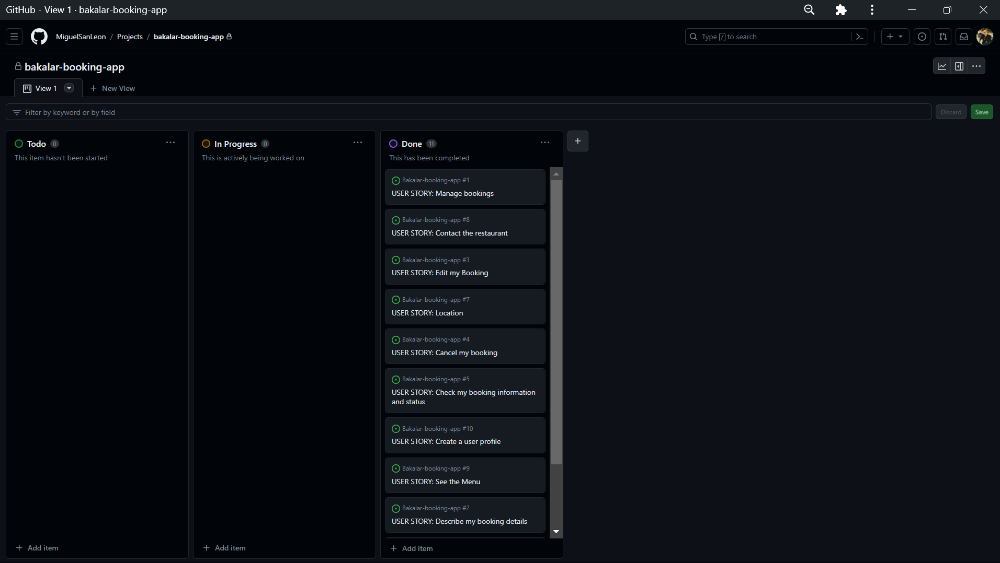

- USER STORY 1: As an Admin, I can manage the bookings so that I can access all the data provided by the user and accept the bookings.

- USER STORY 2: As a User, I can select the time, date, number of guests, and add comments to my booking so that I can describe my booking details properly.

- USER STORY 3: As a User, I can edit my booking so that I can change the date, time, number of guests, or add a comment.

- USER STORY 4: As a User, I can delete my booking from the website so that I can cancel it.

- USER STORY 5: As a User, I can view my booking so that I can check my booking details and status.

- USER STORY 6: As a User, I can book a table on the website so that I don't need to call the restaurant for a booking.

- USER STORY 7: As a User, I can see the correct restaurant address so that I can find the exact location of the restaurant, the better route, and the estimated time of arrival.

- USER STORY 8: As a User, I can navigate to the contact page so that I can have the restaurant address and contact details.

- USER STORY 9: As a User, I can see the restaurant menu so that I can decide whether to book a table or not.

- USER STORY 10: As a User, I can create a user profile so that I can log in to book a table.

- USER STORY 11: As a User, I can edit my user profile so that I can update my data on the website.

### Strategy Table

Opportunity/Problem/Feature| Importance| Viability/Feasibility
------------ | -------------------------|---------
Responsive design | 5 | 5
Display restaurant Menu | 5 | 5
Account registration | 5 | 5
User profile | 5 | 5
Create a booking | 5 | 5
Update a booking | 5 | 5
Cancel a booking | 4 | 4
Contact form | 3 | 4
Avoid double bookings | 4 | 1
Booking acceptance email | 3 | 1

Total | 44 | 40

[Go to the top](#table-of-contents)

## Scope

As not all features can be implemented in the first release of the project, it will be divided into two phases. The first phase will include the features that have been identified to build the minimum viable product.

### Phase 1

- Responsive design
- Account registration
- User profile
- Display restaurant Menu
- Create a booking
- Update a booking
- Cancel a booking

### Phase 2

- Contact form
- Avoid double bookings
- Booking acceptance email
- Account email verification
- Social media signup

[Go to the top](#table-of-contents)

## Structure

### Database model

This is the database scheme first model:

And this is the final database structure:

### Colour Scheme

I decided to use a gradient background from [Uigradients](https://uigradients.com/)

### Typography

I chose two fonts for this project: Baskerville and Bebas Neue, with sans-serif as the fallback font for both.

This fonts can be found [here](https://fonts.google.com/)

### Wireframes

[Balsamiq](https://balsamiq.com/) has been used to create all the wireframes for desktop and mobile views for this project.

Page | Desktop Version | Mobile Version
--- | --- | ---
Landing page/user logout | 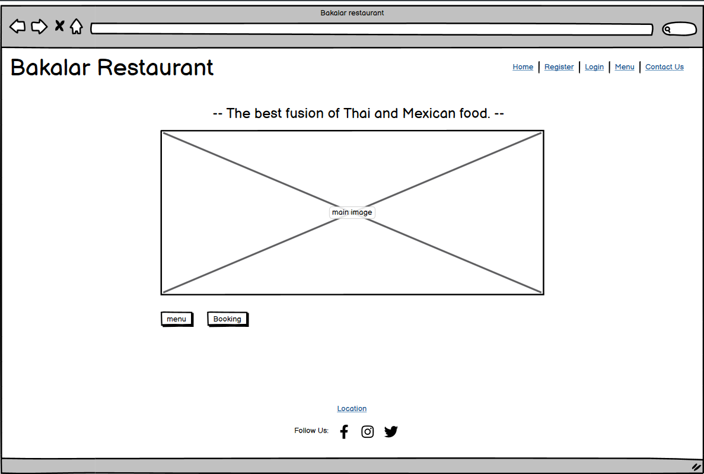 | 
Landing page/ user login |  | 
Sign up page |  | 
Menu page |  | 
Sign in page | 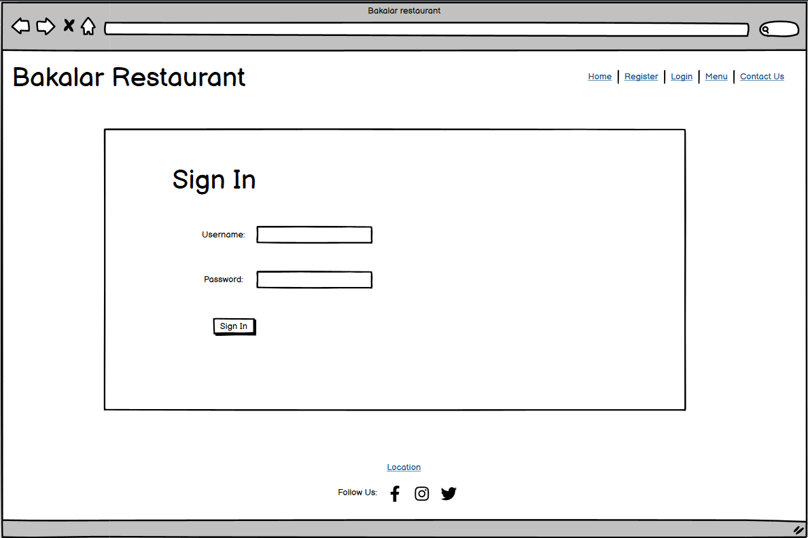 | 
Sign out page |  | 
Contact page |  | 
Booking page |  | 
Booking Preview page | 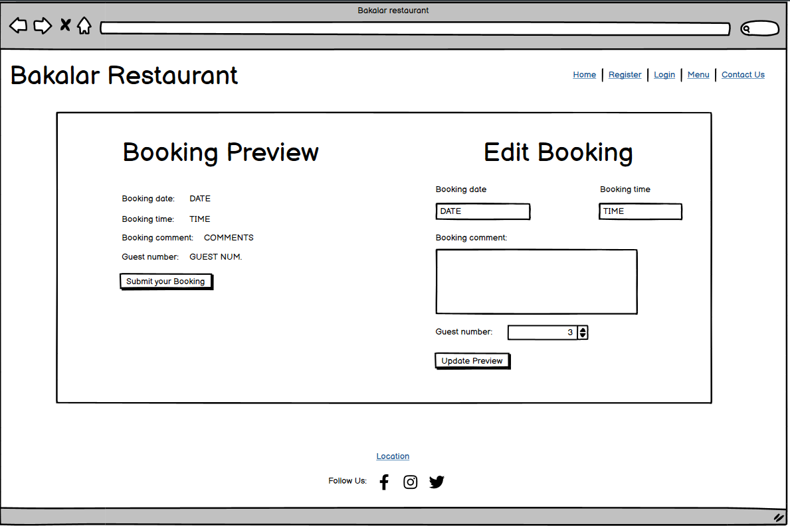 | 
Check Booking page |  | 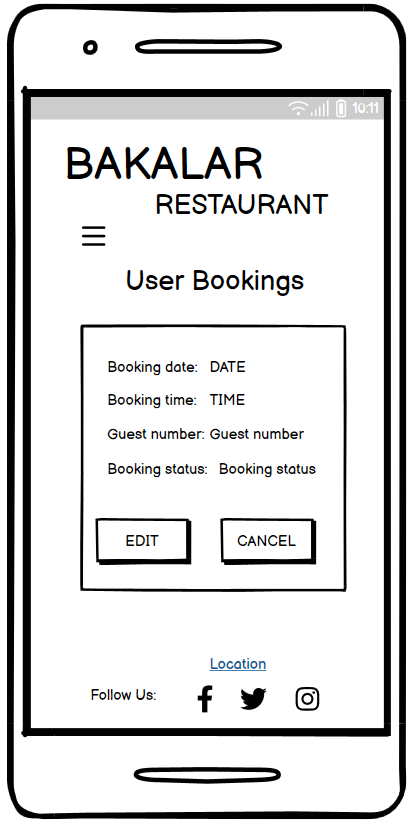
Edit Booking page |  | 
Edit User Profile page | 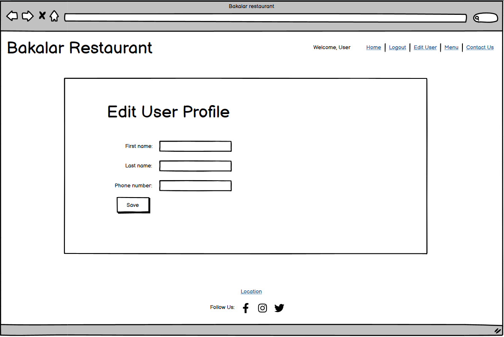 | 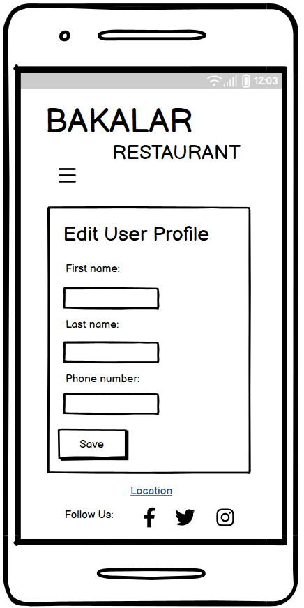

[Go to the top](#table-of-contents)

## Features

### General

This web application has been designed with bootstrap5 to be responsive across all devices.

- Navigation bar:
  - Navigation bar when there's no user logged in:

  - Navigation bar when there's a user logged in:

  - The navigation bar contains links to all the sections and  has a hover effect that changes color to provide feedback to the Site User for a better user experience. It also shows the active page highlighting the page name in yellow.

- Footer:
  - Footer image:

  - The footer contains a link (location) to contact page where the user can find a map, the restaurant address, an email and the phone number.
  - The footer contains links to social media channels.

### Home Page

- The home page features a prominent title positioned above a main image.
- Below the main image, the user can find a menu button and a booking button when not logged in.

- When the user is logged in and has some bookings already the index page displays a third button named "check your bookings".

### Register Page

- This is a customized registration form. First name, last name, and phone number have been added to the original Django registration form.
- The username has to be unique as it is the primary key.
- The email is the only optional field.
- The phone number needs to contain 11 digits.
- Password1 and Password2 must match.
- The password needs to contain both letters and numbers and cannot be a commonly used password.
- All error messages will be displayed in the form to provide correct feedback to the user in case something went wrong during the registration process.
- When the process is finished, the user will receive a successful message.

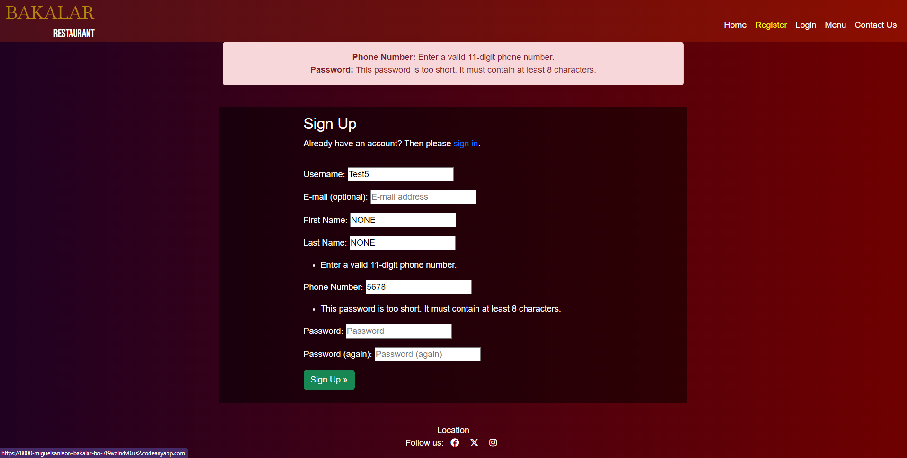

### Edit User Profile Page

- The Edit User Profile Page contains three input fields corresponding to the personal contact data from the user profile.
- The phone number needs to be 11 digits long, and the form also provides error messages when an error occurs.
- When the process is finished, the user will receive a successful message.

### Login and Logout

- The login page is a simple form where the user has to provide the username and the password.
- The page displays a welcome message indicating to the user that to make a booking, they need to sign up first if they don't have an account.
- Incorrect credentials will trigger error messages to be displayed.
- When the process is finished, the user will receive a successful message.

- This page only asks the user if they are sure to log out and provides a button to proceed.
- When the process is finished, the user will receive a successful message.

### Menu page

- The menu page contains a carousel with a group of images showcasing the different dishes in the menu, equipped with an arrow system for navigation.
- Each image includes the name of the dish and a brief description.

### Booking Page, Preview Booking Page and Booking Confirmation

- The booking page shows a booking form that contains 4 fields:

  1. The booking date field is required and must be the present day or a future date. It has a calendar widget that can be used to pick the date.
  2. The booking time field is also required and must be between 14:00 and 22:00, as the message says. It also has a widget to pick the hour and minutes.
  3. The booking comments field is a text area where the user is invited to write any food allergies, special requests, and specify if there are any children in the group. This field is not required.
  4. The guest number field is required and has a limit of 12 people. If the user selects a number greater than 12, the form shows a message asking the user to call by phone for that special case.

- The form displays error messages when an error occurs.
- When the user clicks on the "Book Your Table" button and the data is validated, the user is redirected to the preview booking page.

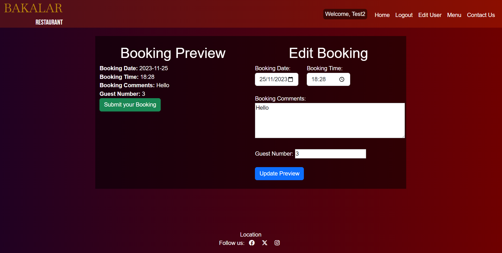

- This page contains two sections: the Booking Preview section and the Edit Booking section.
- The Booking Preview section contains all the information that the user has provided in the booking form. Below that information, there is a button to submit the booking as it is.
- The Edit Booking section is prepopulated with the booking information provided by the user and can be edited. Under the form, there is a button to update the Preview Booking section with all the changes applied to the booking.
- The form displays error messages when an error occurs.
- When the user clicks on the "Submit your Booking" button, the user is redirected to the New Booking Page, and a successful message is displayed on the New Booking Page.

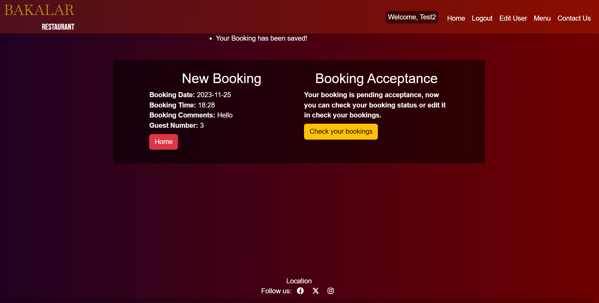

- The New Booking Page shows all the booking details and a "Home" button under it.
- It also displays a message about the booking acceptance process and a "Check Your Bookings" button where the user can check the booking status.

### Check Your Bookings Page

- This page contains all the user's bookings displayed as cards with two buttons, "Edit" and "Cancel."
- The cards also display the status information of the booking so the user can see if the booking is pending, accepted, or has been canceled by the restaurant.

- When the user clicks on the "Cancel" button, the web shows a confirmation message with two buttons under it, "Yes" or "No."
- Pressing the "Yes" button redirects the user to the "Check Your Bookings" page again, and a successful message will be displayed on the page.
- If the user clicks on the "No" button, the user will be redirected to the "Check Your Bookings" page without deleting the booking.

### Edit Bookings

- If the user clicks on the "Edit" button in one of the booking cards, the user will be redirected to the Edit Booking page.
  

- The user can edit the booking data in the prepopulated form that will show the current booking data.
- If the user clicks on the "Save the Changes" button, he/she will be redirected to the "Check Your Bookings" page, and the booking card will show the new booking data. A successful message will be posted on the page.
- The form displays error messages when an error occurs.

### Contact Us

- On this page, the user can find the contact information of the restaurant and a map that shows the exact location of the restaurant.

### Forbidden Page

- This page shows a message if a user tries to access other users' booking data using the edit booking page.

[Go to the top](#table-of-contents)

## Technologies Used

### Languages Used

- [HTML5](https://en.wikipedia.org/wiki/HTML)
  - The project uses HyperText Markup Language.
- [CSS3](https://en.wikipedia.org/wiki/CSS)
  - The project uses Cascading Style Sheets.
- [JavaScript](https://en.wikipedia.org/wiki/JavaScript)
  - The project uses JavaScript.
- [Python](https://en.wikipedia.org/wiki/Python_(programming_language))
  - The project uses Python.

### Frameworks, Libraries and Programs Used

- [Django 3](https://docs.djangoproject.com/en/3.2/)
  - The project uses Django 3.2
- [Boostrap 5](https://getbootstrap.com/docs/5.0/getting-started/introduction/)
  - The project uses Bootstrap 5.
- [ElephantSQL](https://customer.elephantsql.com/instance)
  - The project uses ElephantSQL as a database provider.
- [Codeanywhere](https://app.codeanywhere.com/)
  - The project uses Codeanywhere.
- [Chrome](https://www.google.com/intl/en_uk/chrome/)
  - The project uses Chrome to debug and test the source code using HTML5.
- [Balsamiq](https://balsamiq.com/)
  - Balsamiq was used to create the wireframes during the design process.
- [Google Fonts](https://fonts.google.com/)
  - Google fonts were used to import the fonts.
- [GitHub](https://github.com/)
  - GitHub was used to store the project's code after being pushed from Git.
- [Heroku](https://dashboard.heroku.com/apps)
  - Heroku was used to deploy the project.
- [Icons8](https://icons8.com/icons)
  - Icons8 was used to find a favicon for the project.
- [Dbdiagram](https://dbdiagram.io/home)
  - Dbdiagram was used to create the database diagram.
- [Tiny PNG](https://tinypng.com)
  - Tiny PNG was used to reduce the file size of the images.
- [Chrome DevTools](https://developer.chrome.com/docs/devtools/)
  - Chrome DevTools was used during development process for code review and to test responsiveness.
- [W3C Markup Validator](https://validator.w3.org/)
  - W3C Markup Validator was used to validate the HTML code.

- [W3C CSS Validator](https://jigsaw.w3.org/css-validator/)
  - W3C CSS Validator was used to validate the CSS code.

- [JSHint](https://jshint.com/)
  - The JSHints JavaScript Code Quality Tool was used to validate the site's JavaScript code.

### Packages / Dependecies Installed

- [Django Allauth](https://django-allauth.readthedocs.io/en/latest/)  
  - Django Allauth was used for user authentication, registration, and account management.
  
- [Gunicorn](https://gunicorn.org/)  
  - Gunicorn was used as Python WSGI HTTP Server for UNIX to support the deployment of Django application.  

- [Cloudinary](https://cloudinary.com/)
  - Cloudinary has been used as static files storage and management solution.

[Go to the top](#table-of-contents)

## Testing

### Code Validation

#### HTML

The [W3C Markup Validator](https://validator.w3.org/) service was used to validate the HTML code of the project in order to ensure there were no syntax errors.

W3C Markup Validator found the following error concerning index.html.
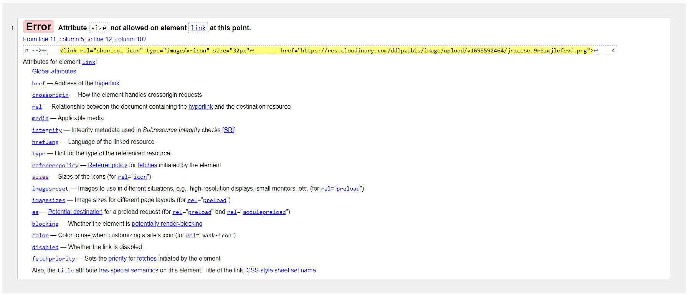

The error was solved removing the size attribute that wasn't working in the favicon link.

W3C Markup Validator found the following error concerning location.html.

The error was solved removing one of the div closing tags and fixing indentation.

#### CSS

[W3C CSS Validator](https://jigsaw.w3.org/css-validator/) service was used to validate the CSS code.

W3C CSS Validator found no errors or warnings on my CSS.

#### Python

| Python file | Errors / Warnings | Code Reviewed |
| --- | --- | --- |
| /admin.py |  | |
| /forms.py | 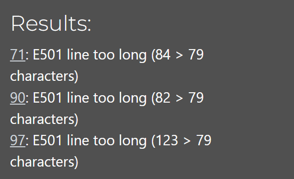 | 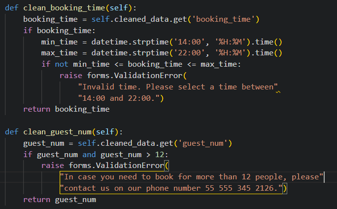 |
| /views.py |  | |
| /models.py |  | |
| /urls.py |  | |

### Accessibility

Lighthouse in Chrome DevTools has been used to confirm that the colors and fonts being used throughout the website are easy to read and accessible. See reports in the table below:

Page | Lighthouse Report |
| --- | --- |
| index.html | 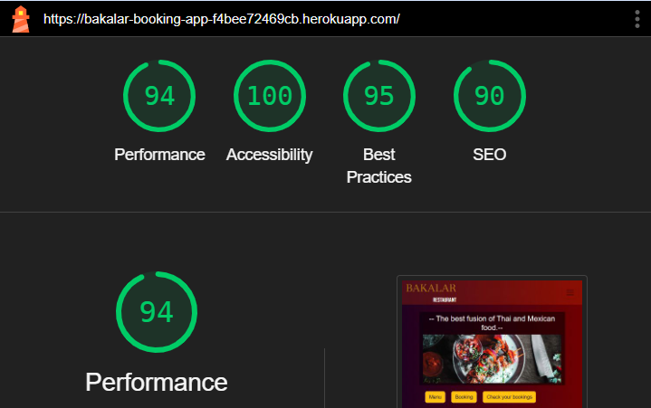 |
| edit-user.html |  |
| menu.html | 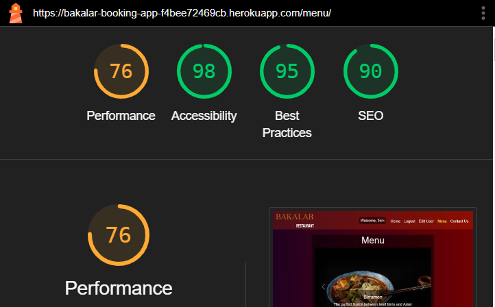 |
| location.html | 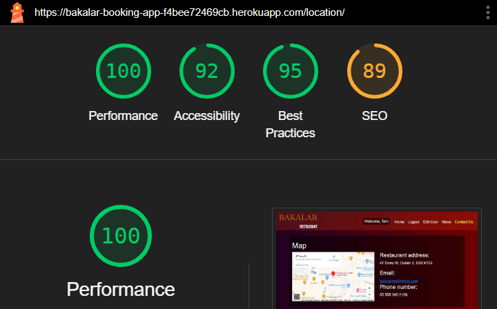 |
| booking | 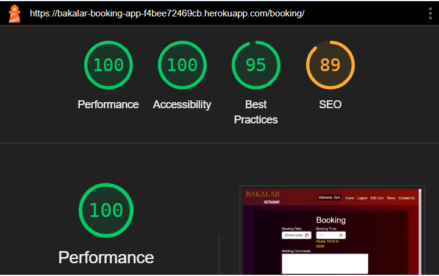 |
| check-bookings.html | 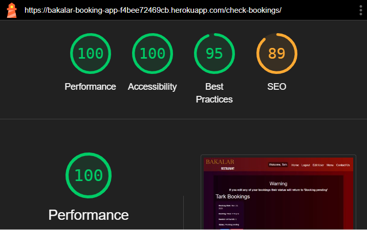 |
| edit-booking.html | 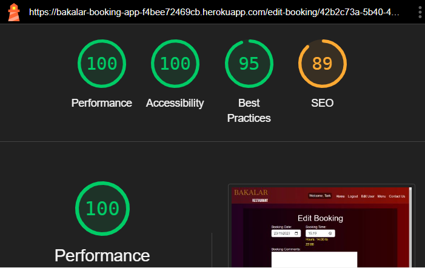 |
| confirm-delete.html |  |

### Tools Testing

#### [Chrome DevTools](https://developer.chrome.com/docs/devtools/)

Chrome DevTools was used during the development process to test, explore and modify HTML elements and CSS styles used in the project.

### Manual Testing

#### Browser Compatibility

Browser | Outcome | Pass/Fail |
--- | --- | --- |
Google Chrome | No appearance, responsiveness nor functionality issues.| ✅ Pass |
Safari | No appearance, responsiveness nor functionality issues. | ✅ Pass |
Mozilla Firefox | No responsiveness nor functionality issues.| ✅ Pass |
Microsoft Edge | No appearance, responsiveness nor functionality issues. | ✅ Pass |

#### Device Compatibility

Device | Operative System |Outcome | Pass/Fail
--- | --- | --- | --- |
 AsusVivoBook 15 | Windows 10 | No appearance, responsiveness nor functionality issues. | ✅ Pass  |
MacBook Pro 15" | macOS Big Sur | No appearance, responsiveness nor functionality issues. | ✅ Pass  |
Dell Inspiron 15 | Windows 10 | No appearance, responsiveness nor functionality issues. | ✅ Pass  |
iPad Pro 12.9" | iOS 15 | No appearance, responsiveness nor functionality issues. | ✅ Pass  |
iPad Pro 10.5" | iOS 15 |No appearance, responsiveness nor functionality issues. | ✅ Pass  |
Samsung Galaxy S8 | Android 7 |No appearance, responsiveness nor functionality issues. | ✅ Pass  |
iPhone 7 | iOS 15 |No appearance, responsiveness nor functionality issues. | ✅ Pass  |

#### Navbar testing

| TEST | OUTCOMES | PASS/FAIL |
| -------- | ----------------------------------------------- | --------------- |
| Bakalar Restaurant title link | Clicking the restaurant name in the navigation bar redirects the user to the home page. | ✅ Pass  |
| Home navbar link | Clicking the "Home" link redirects the user to the home page. The link is highlighted in yellow when on the home page. Hover effects make the home link orange. | ✅ Pass  |
| Register navbar link | Clicking the "Register" link redirects the user to the Signup page. The link is highlighted in yellow on the Signup page and turns orange on hover. This link disappears when the user is logged in. | ✅ Pass  |
| Login navbar link | Clicking the "Login" link redirects the user to the Login page. The link is highlighted in yellow on the Login page and turns orange on hover. This link disappears when the user is logged in. | ✅ Pass  |
| Menu navbar link | Clicking the "Menu" link redirects the user to the Menu page. The link is highlighted in yellow on the Menu page and turns orange on hover. | ✅ Pass  |
| Contact Us navbar link | Clicking the "Contact Us" link redirects the user to the Location page. The link is highlighted in yellow on the Location page and turns orange on hover. | ✅ Pass  |
| Logout navbar link | When logged in, clicking "Logout" redirects the user to the Sign out page. The link is highlighted in yellow on the Sign out page and turns orange on hover. | ✅ Pass  |
| Edit User navbar link | When logged in, clicking "Edit User" redirects the user to the Edit User page. The link is highlighted in yellow on the Edit User page and turns orange on hover. | ✅ Pass  |  
| Navbar welcome message | When logged in, the navbar displays a customized welcome message with the username. | ✅ Pass  |

#### Footer testing

| TEST | OUTCOMES | PASS/FAIL |
| ----------------- | --------------------------------------------- | --------------- |
| Location link | Clicking the "Location" link redirects the user to location.html. The link turns orange on hover. | ✅ Pass  |
| Facebook icon | Clicking the Facebook icon opens the Facebook page in a different tab. The icon turns orange on hover. | ✅ Pass  |
| X icon (Twitter) | Clicking the X (Twitter) icon opens the X page in a different tab. The icon turns orange on hover. | ✅ Pass  |
| Instagram icon | Clicking the Instagram icon opens the Instagram page in a different tab. The icon turns orange on hover. | ✅ Pass  |

#### Index

| TEST | OUTCOMES | PASS/FAIL |
| ---------------- | -------------------------------- | --------------- |
| Menu button | Clicking on the Menu button redirects the user to menu.html | ✅ Pass  |
| Booking button | Clicking on the Booking button redirects the user to booking.html | ✅ Pass  |
| Check your bookings button | Clicking on the "Check Your Bookings" button redirects the user to check-bookings.html | ✅ Pass  |

#### Menu

| TEST | OUTCOMES | PASS/FAIL |
| --------------------- | --------------------------------------------- | --------------- |
| Left arrow control | Clicking on the left arrow control moves the carousel to show the previous image. | ✅ Pass |
| Right arrow control | Clicking on the right arrow control moves the carousel to show the next image. | ✅ Pass |

#### Booking

| TEST | OUTCOMES | PASS/FAIL |
| -------------------- | --------------------------------------------- | --------------- |
| Date picker | Picking a past date displays the error message: "Invalid date. Please select a date in the future." If the user leaves the date input field empty, the web shows the message: "This field is required." | ✅ Pass |
| Time picker | Picking a time outside of 14:00 to 22:00 displays the message: "This field is required." | ✅ Pass |
| Guest number | Leaving the guest number field empty displays the error message: "This field is required." Entering a number greater than 12 displays the error message: "In case you need to book for more than 12 people, please contact us on our phone number 55 555 345 2126." | ✅ Pass |
| Book your table button | Clicking the "Book your table" button shows the pertinent error messages. In case all the fields are valid, the user is redirected to the preview-booking page. | ✅ Pass |

#### Preview Booking

| TEST | OUTCOMES | PASS/FAIL |
| ----------------------- | --------------------------------------------- | --------------- |
| Date picker | Picking a past date and pressing the "Update Preview" button redirects the user to the booking page and shows the error message: "Invalid date. Please select a date in the future." Picking a future valid date and pressing the "Update Preview" button updates the date in the Booking Preview section. | ✅ Pass |
| Time picker | Picking a time outside of 14:00 to 22:00 displays the message: "This field is required." Picking a valid time and pressing the "Update Preview" button updates the time in the Booking Preview section. | ✅ Pass |
| Guest number | Leaving the guest number field empty redirects the user to the booking page and shows the error message: "This field is required." Entering a number greater than 12 redirects the user to the booking page, and the web displays the error message: "In case you need to book for more than 12 people, please contact us on our phone number 55 555 345 2126." | ✅ Pass |
| Submit your booking button | Clicking the "Submit your Booking" button redirects the user to the New Booking page. | ✅ Pass |

#### New Booking

| TEST | OUTCOMES | PASS/FAIL |
| ------------------- | --------------------------------------------- | --------------- |
| Home button | Clicking the "Home" button redirects the user to the Home page. | ✅ Pass |
| Check your bookings button | Clicking the "Check Your Bookings" button redirects the user to the Check-bookings page. | ✅ Pass |

#### Check bookings

| TEST | OUTCOMES | PASS/FAIL |
| --------------- | --------------------------------------------- | --------------- |
| Edit buttons | Clicking on any "Edit" button on the booking cards redirects the user to the Edit-booking page. | ✅ Pass |
| Cancel buttons | Clicking on any "Cancel" button on the booking cards redirects the user to the confirmation-delete page. | ✅ Pass |

#### Delete Booking

| TEST | OUTCOMES | PASS/FAIL |
| --------------- | --------------------------------------------- | --------------- |
| Yes button | Clicking the "Yes" button deletes the booking from the database, and the web redirects the user to the Check-bookings page. A successful message is displayed on the web. | ✅ Pass |
| No button | Clicking the "No" button redirects the user to the Check-bookings page. | ✅ Pass |

#### Edit User

| TEST | OUTCOMES | PASS/FAIL |
| ------------------- | --------------------------------------------- | --------------- |
| Phone number field | Entering a number with less or more than 11 digits and pressing the "Save" button displays the error message "Enter a valid 11-digit phone number." | ✅ Pass |
| Save button | Leaving any empty field in the form and pressing "Save" displays the message: "This field is required." When all the fields are valid, and the user presses "Save," the user is redirected to the Index page, and a successful message is displayed on the page. | ✅ Pass |

#### Register

| TEST | OUTCOMES | PASS/FAIL |
| ------------------- | --------------------------------------------- | --------------- |
| Login page link | Clicking on the "Sign in" link redirects the user to the login page. | ✅ Pass |
| Username Field | Pressing the sign-up button with the Username field empty displays the message: "This field is required." If the user picks a username already in use, the web displays the error message: "A user with that username already exists." | ✅ Pass |
| Email field | Picking an email address already in use displays the error message: "A user is already registered with this email address." | ✅ Pass |
| First Name field | Pressing the sign-up button with the First Name field empty displays the message: "This field is required." | ✅ Pass |
| Last Name field | Pressing the sign-up button with the Last Name field empty displays the message: "This field is required." | ✅ Pass |
| Phone number field | Entering a number with less or more than 11 digits and pressing the "Save" button displays the error message "Enter a valid 11-digit phone number." | ✅ Pass |
| Password fields | Leaving one of the Password fields empty displays the message: "This field is required." If the Password fields don't match, the form displays the message: "You must type the same password each time." If the password is not safe or has fewer than 8 digits, the form displays an error message to guide the user on how to fix the problem. | ✅ Pass |
| Sign up button | Clicking the sign-up button with all valid fields redirects the user to the home page, and a successful message is displayed on the page. The customized welcome message in the navbar is shown with the username. | ✅ Pass |

#### Login

| TEST | OUTCOMES | PASS/FAIL |
| ------------------ | --------------------------------------------- | --------------- |
| Sign Up page link | Clicking on the "Sign Up" link redirects the user to the Register page. | ✅ Pass |
| Username field | Leaving the Username field empty displays the message: "This field is required." If the username is incorrect, the error message: "The username and/or password you specified are not correct." is displayed. | ✅ Pass |
| Password field | Leaving the Password field empty displays the message: "This field is required." If the password is incorrect, the error message: "The username and/or password you specified are not correct." is displayed. | ✅ Pass |
| Sign In button | Clicking the "Sign In" button with correct fields redirects the user to the Home page, and a successful message is displayed on the page. The customized welcome message in the navbar is shown with the username. The navbar links show the "Logout" and "Edit User" links. | ✅ Pass |

#### Logout

| TEST | OUTCOMES | PASS/FAIL |
| ----------------- | --------------------------------------------- | --------------- |
| Sign out button | Clicking the "Sign Out" button redirects the user to the Home page, and a successful message is displayed. The welcome message disappears from the Navbar, and the navbar links show the "Register" and "Login" links. | ✅ Pass |

#### Forbidden

| TEST | OUTCOMES | PASS/FAIL |
| ------------------------- | --------------------------------------------- | --------------- |
| Forbidden permission | When a user tries to edit another user's booking by copying another user's booking number and pasting it in the browser, the web redirects the user to the Forbidden page. | ✅ Pass |

[Go to the top](#table-of-contents)

## Deployment

This project was developed using a [Codeanywhere](https://app.codeanywhere.com/) workspace. The code was commited to [Git](https://git-scm.com/) and pushed to [GitHub](https://github.com/") using the terminal.

### Deploying on Heroku

To deploy this page to Heroku from its GitHub repository, the following steps were taken:

1. Create the Heroku App:
    - Select "Create new app" in Heroku.
    - Choose a name for your app and select the location.

2. Prepare the environment and `settings.py` file:
    - In the Settings tab, click on Reveal Config Vars and copy the url next to DATABASE_URL.
    - In your Codeanywhere workspace, create an `env.py` file in the main directory.
    - Add the DATABASE_URL value, your chosen SECRET_KEY value and the Cloudinary API_KEY to the `env.py` file.
    - Add the SECRET_KEY value to the Config Vars in Heroku.
    - Update the `settings.py` file to import the env file and add the SECRETKEY and DATABASE_URL file paths.
    - Update the Config Vars with the Cloudinary url, adding into the `settings.py` file also.
    - In `settings.py` add the following sections:
        - Cloudinary to the INSTALLED_APPS list
        - STATICFILE_STORAGE
        - STATICFILES_DIRS
        - STATIC_ROOT
        - MEDIA_URL
        - DEFAULT_FILE_STORAGE
        - TEMPLATES_DIR
        - Update DIRS in TEMPLATES with TEMPLATES_DIR
        - Update ALLOWED_HOSTS with ['app_name.heroku.com', 'localhost']

3. Store Static and Media files in Cloudinary and Deploy to Heroku:
    - Create three directories in the main directory; media, storage and templates.
    - Create a file named "Procfile" in the main directory and add the following:
        - web: gunicorn project-name.wsgi
    - Go to Deploy tab on Heroku and connect to the GitHub, then to the required repository.
    Click on Delpoy Branch and wait for the build to load. When the build is complete, the app can be opened through Heroku.

[Go to the top](#table-of-contents)

## Credits

### Content

- Website content was written by the developer.
  
### Media

- [Pexel](https://www.pexels.com/)
  
  - Main image in Home page: [Main image](https://www.pexels.com/photo/cooked-food-in-stainless-steel-plate-2641886/)
  - Birramen image in Menu page: [Birramen image](https://www.pexels.com/photo/cooked-noodles-on-ceramic-bowl-1907229/)
  - Red and green curry pork tacos in Menu page: [Tacos image](https://www.pexels.com/photo/close-up-of-tacos-on-a-wooden-chopping-board-8230019/)
  - Dumpling image in Menu page: [Dumpling image](https://www.pexels.com/photo/soup-with-dimsums-and-vegetables-on-ceramic-bowl-5409015/)
  - Asian Wonton nachos in Menu page: [Asian nachos image](https://www.pexels.com/photo/food-healthy-wood-dinner-6544374/)
  
### Code

- [Stack Overflow](https://stackoverflow.com/) and [W3Schools](https://www.w3schools.com/) were consulted on a regular basis.
- [Django documentation](https://docs.djangoproject.com/en/3.2/) and [Bootstrap](https://getbootstrap.com/docs/5.3/getting-started/introduction/) were consulted for a better understanding of this frameworks.
- [Coding Ninja](https://www.codingninjas.com/studio) was consulted to get information about allauth library.

[Go to the top](#table-of-contents)

## Known Bugs

- The error messages from django-allauth forms are displayed twice, once in the form and the other one in the error message area.

[Go to the top](#table-of-contents)

## Acknowledgements

- I would like to thank my family for their support and love.
- I am very grateful to my mentor, Marcel, for his invaluable help and advice that have greatly contributed to the development of all my projects.
- Of course, I have to mention and thank Code Institute and its amazing Slack community for their support and for providing me with the necessary knowledge to complete this project.

[Go to the top](#table-of-contents)
